# Elastic Search Tutorial

## Designing Schema for Elasticsearch

* Objective of Search
    * Find the most relevant documents with your search terms

* Steps
    * Crawl or load documents into a search engine
    * Build an index to lookup documents
    * Score documents for every search term
    * Search using the Query DSL (Domain Specific Language)

* Elastic Search is distributed, highly available, schemaless, powerful query DSL, analytical processing

* Installing Elastic Search on a local machine

    * Download it [here](https://www.elastic.co/downloads/elasticsearch)
    * You can install it using the binaries, a package manager (homebrew), or even using a Docker image
    * Inside this repository you can run `docker-compose up` since we have a `docker-compose.yaml` file inside.


* Node
    * Single server (or virtual machine)
    * Performs indexing
    * Allows search
    * Has unique id and name

* Cluster
    * Collection of nodes
    * Holds the entire indexed data
    * Has a unique name
    * Nodes join the cluster using the cluster name

* Document
    * Basic unit of information to be indexed
    * Expressed in JSON
    * Resides within an index

* Index
    * Collection of similar documents
    * Identified by name
    * Any number of indices in a cluster
    * Different indices for different logical grouping

* Shards
    * Split the index across multiple nodes in the cluster
    * Sharding an index
        * Having the data in one index in multiple nodes 
        * 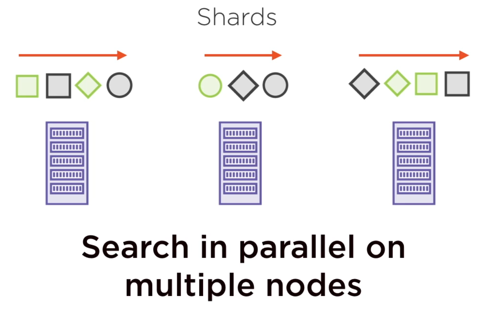
    * Index sharding is needed when the amount of data to be indexed is too big for one single machine to handle. Most of the times sharding is required because the disk space on a single machine is not big enough, but limited memory or limited CPU power can also be the reason.

* Replica
    * For high availability of your data 
    * Elastic Search replicates every index. Having said that, the same data is stored in multiple nodes in the cluster
    * In case you have a node failure, tha data will still be available from the replica
    * Now we can perform search on shards + replicas
    * 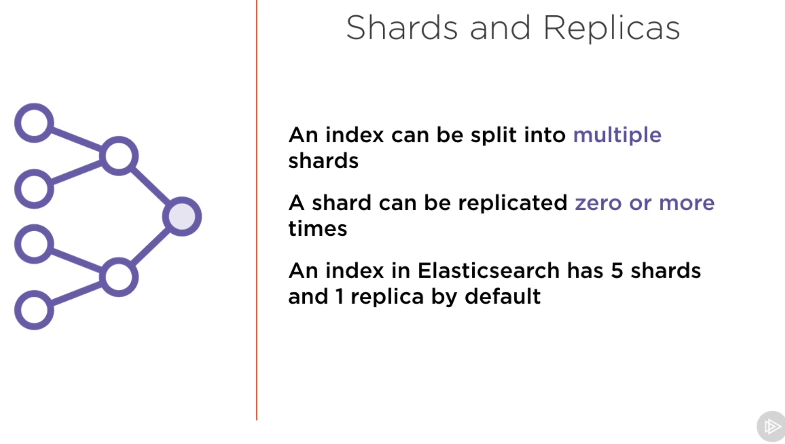
        * Specifying the number of shards is static 
            * Can only be done at index creation time
        * Specifying the number of replicas is dynamic 
            * Can be changed after the index is created and populated

* TF/IDF Relevance Algorithm 

    * Term Frequency
        * How often does the term appears in the field?
        * The more it occurs, the more relevant it is
    
    * Inverse Document Frequency
        * How often does the term appear in the index?
            * The entire index of documents
        * If it is a rare term that occurs in a particular document but not so often in the index, that term is more relevant to that document. 
    
    * Field-length norm
        * How long is the field which was searched? 
            * The longer the field, the less relevant the term

* Mappings

    * Schema definition 
        * What data types the fields map to
    
    * Storage and indexing 
        * Determines how documents are stored and indexed
    
    * 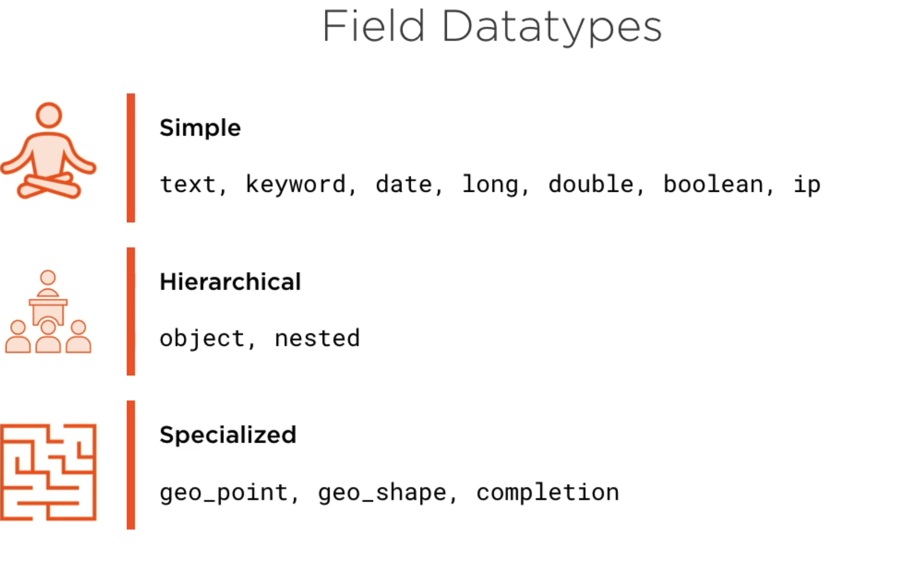

        * If no data types are specified, Elasticsearch will try and guess the right type
        * This is called dynamic mapping
    
    * 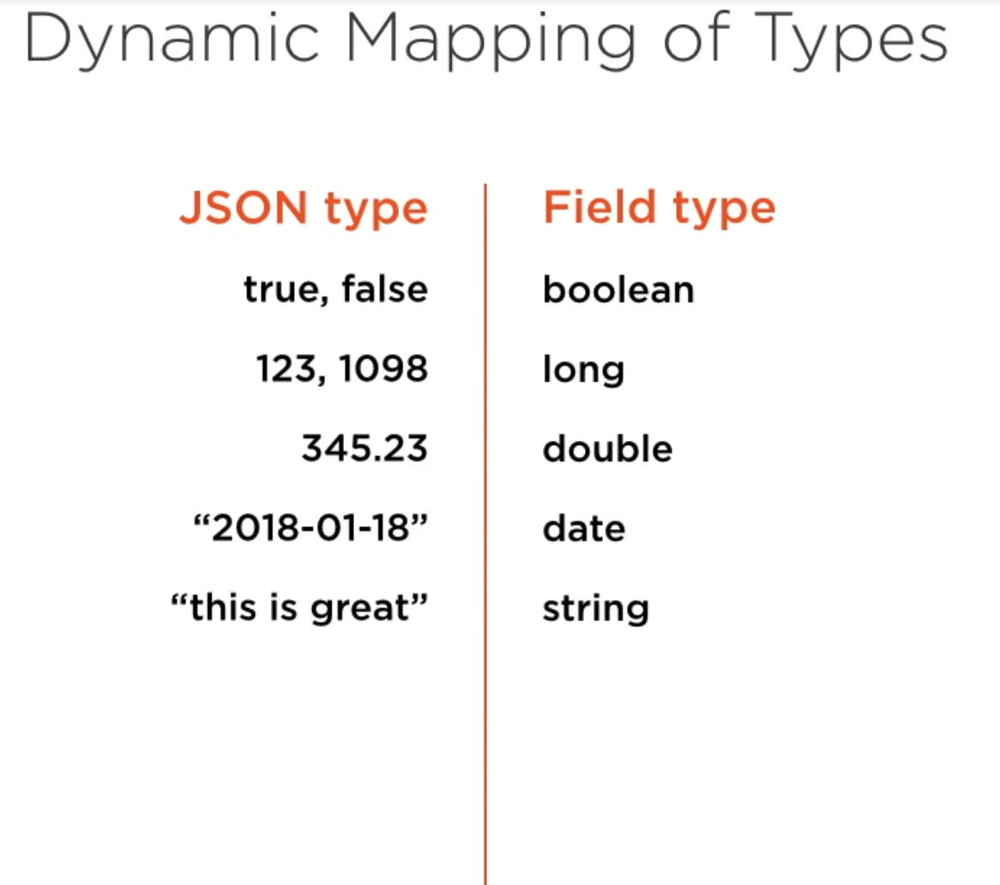

    * String fields

        * Full text search (`text` data type)
            * Individual tokens in the string are searchable
            * You can apply regex 
            * Partial matches are possible
            * 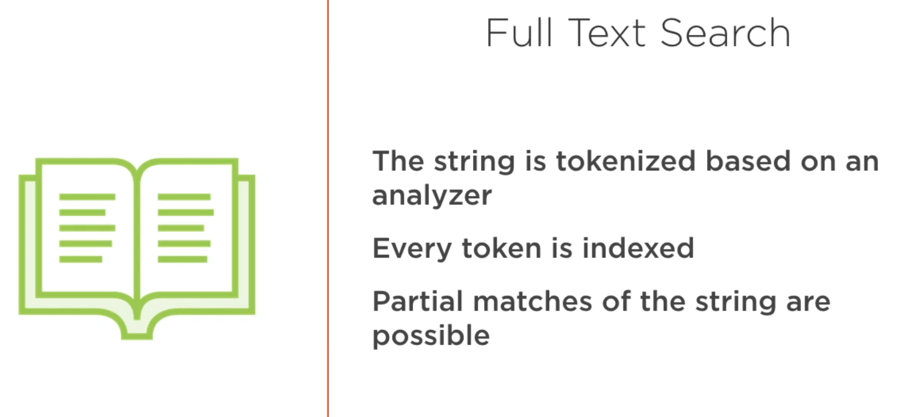 

            *  

        * Keyword search (`keyword` data type)
            * Focus on exact matches
            * Only whole string values are searchable

            * 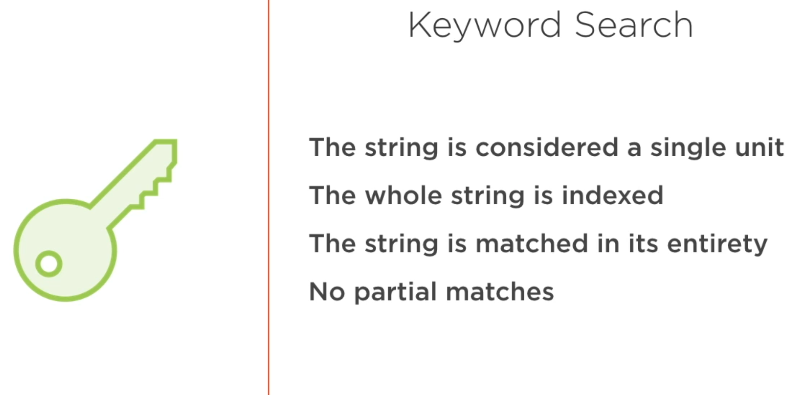 

            * 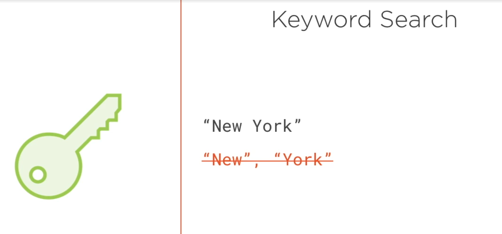 
    
    * Mapping a single field (any field) in different ways for different purposes is called **multi-field**

    * 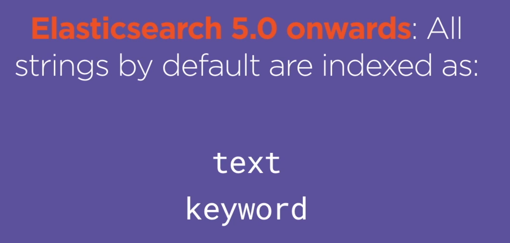 

* Demo

    * Check Postman collections for more details
        * `http://127.0.0.1:9200/books/fiction/1?pretty`
            * The index is **books**
            * From ES 6.0 forward we can only have one type per index, in this case **fiction**
            * The document id is **1**
                * This is not mandatory, ES can generate the `id` for you
    
    * Keyword search - usually used for sorting, filtering and aggregations
        * Keyword fields only accepts 256 characters
        * Example aggregation:
            * ```json
                GET /_search
                {
                    "aggs" : {
                        "genres" : {
                            "terms" : { "field" : "genre" } 
                        }
                    }
                }
                ```
            * ```json
                {
                    "aggregations" : {
                        "genres" : {
                            "doc_count_error_upper_bound": 0, 
                            "sum_other_doc_count": 0, 
                            "buckets" : [ 
                                {
                                    "key" : "electronic",
                                    "doc_count" : 6
                                },
                                {
                                    "key" : "rock",
                                    "doc_count" : 3
                                },
                                {
                                    "key" : "jazz",
                                    "doc_count" : 2
                                }
                            ]
                        }
                    }
                }
                ```
    
    * Lets specify mappings for our books index
        * Here we specify the mappings for the fiction type, to set `_source` to be disable
            * Contains the entire JSON of the document, not indexed and not searchable
            * This takes extra disk space
            * ```json
                {
                    "mappings": {
                        "fiction": {
                            "_source": {
                                "enabled": false
                            }
                        }
                    }
                }
                ```
        
        * **Mappings can be set only when the index is created, they cannot be edited after that**
            * ```json
                DELETE /books?pretty
                ```
        * The only update you can make to mappings it to **add new fields**
        
    * 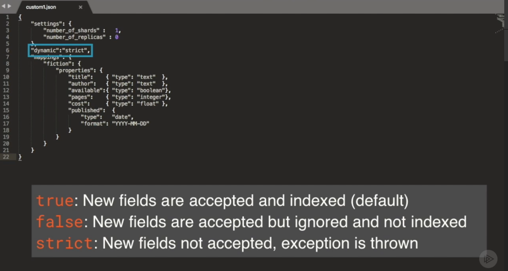

    * 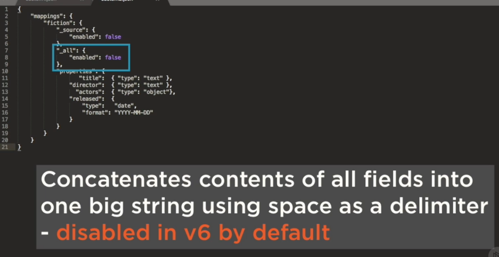 

    * 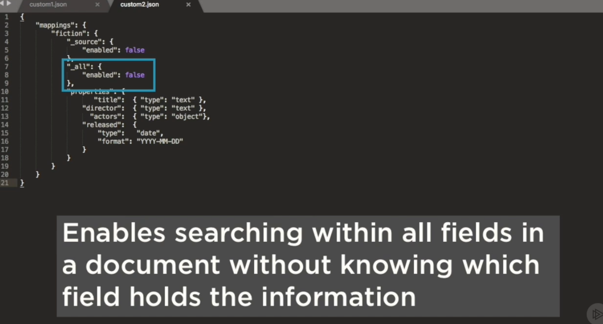 

    *  

        * `match_mapping_type`: Match those fields which have the type specified
            * Example: all numeric fields should be mapped to floating point
        
        * ```json
            "dynamic_templates": [
                {
                    "integers": {
                        "match_mapping_type": "long",
                        "mapping": {
                            "type": "integer"
                        }
                    }
                },
                {
                    "strings": {
                        "match_mapping_type": "string",
                        "mapping": {
                            "type": "text"
                        }
                    }
                }
            ]
            ```
    
    * 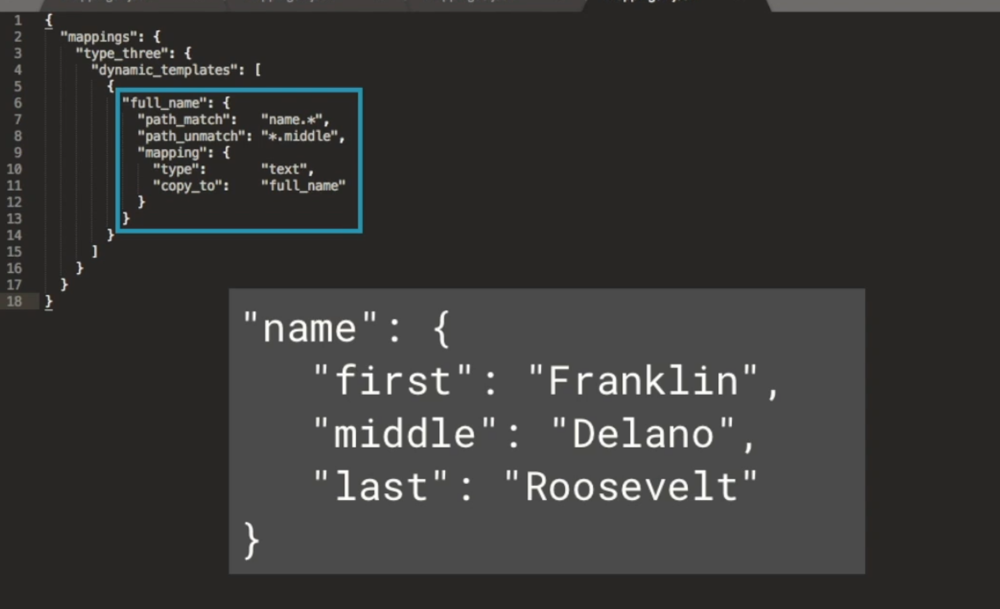 


* Analyzer

    * How document is parsed and tokenized before the terms are stored in the index

    * Normalization, Stemming, Synonyms

    *  
        * Normalization happens at indexation and search time
        * Example:
            * Date: date, datE, etc...
    
    * 
        * Terms should be stemmed to the root form, so matches can happen no matter what type of word formation we use. 
        * Example:
            * Run: running, runs, ran, etc..
    * 
        * Elastic Search also finds common synonymous to the words
    
    * Tokenize
        * Break text into individual terms which are added to the inverted index
    
    * Normalize
        * Set up the terms in some standard form along with synonyms to improve their recall
    
    * Before adding to an index the following is done:
        * 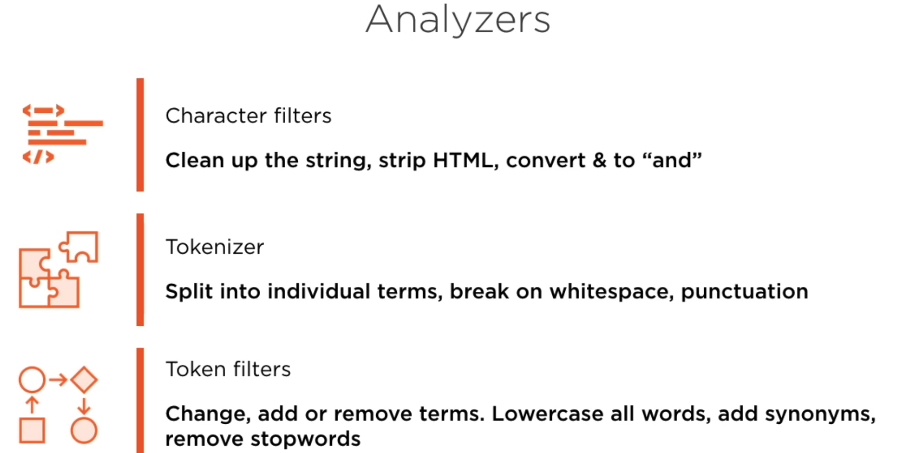 
    
    * 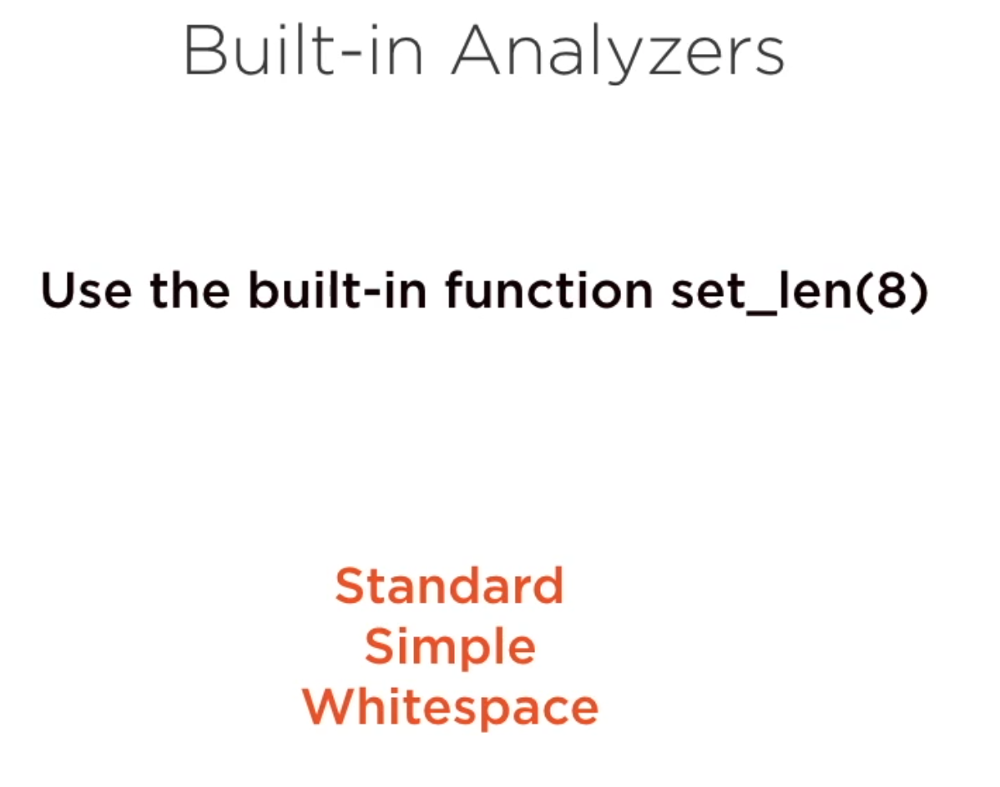 
        * 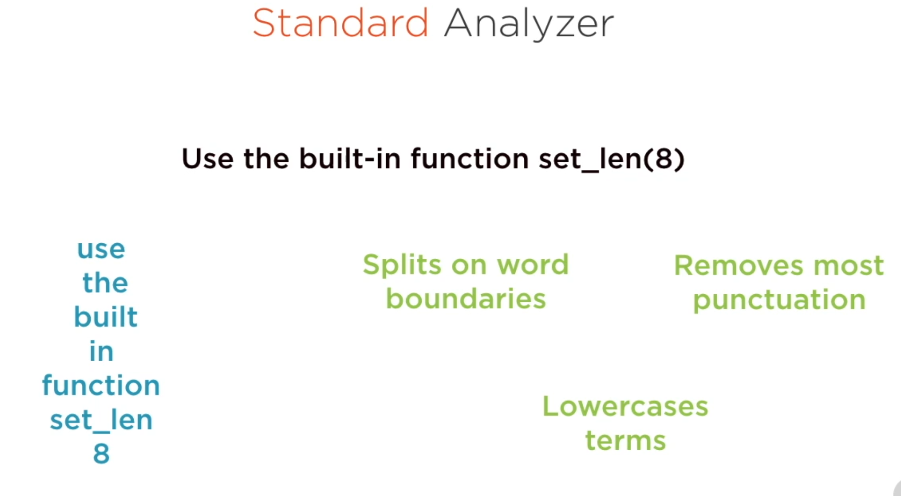  
        * 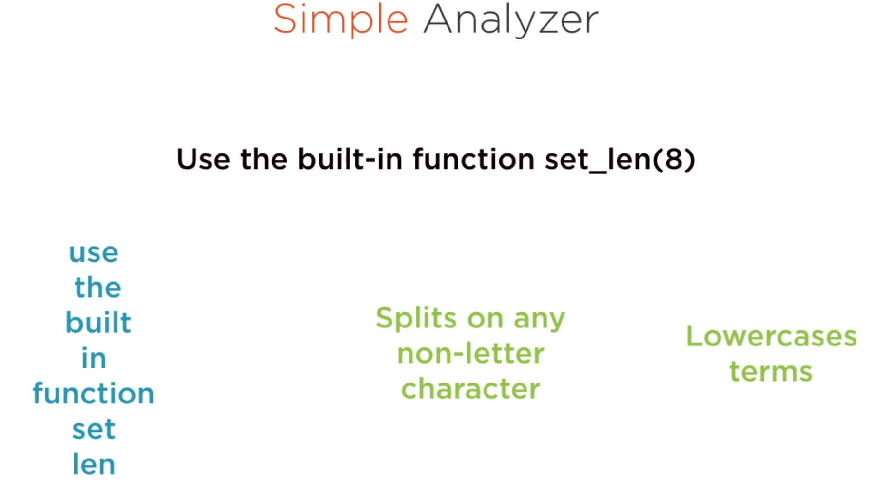 

* Demo

    * POST on `http://127.0.0.1:9200/_analyze?pretty`
        * Check Postman for more details
        * This api let us see our analyzer in action

    * tokenizer
        * keyword: Considers the text as a whole, and those not split it

    * char_filter
        * html_strip: to remove html tags
        * this is an array that can contain many filters
    
    * 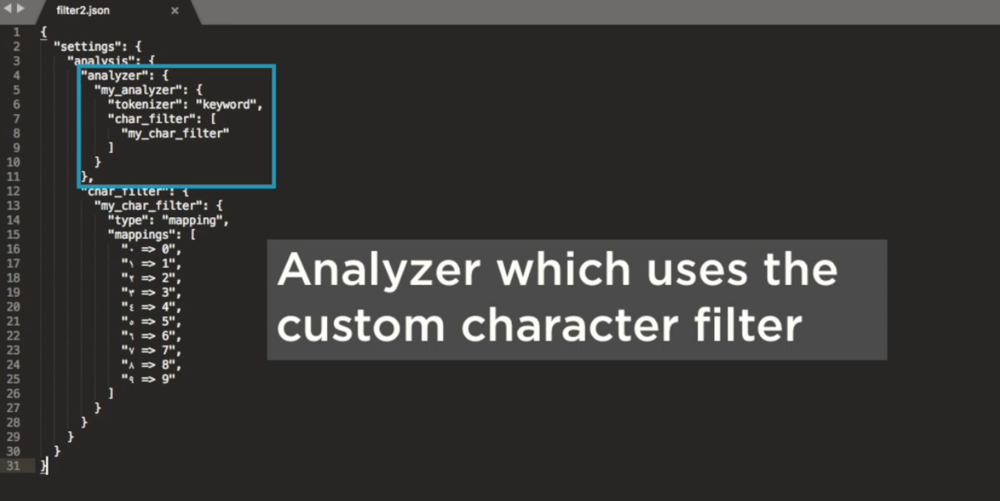
        * Create an index with this custom analyzer
        * 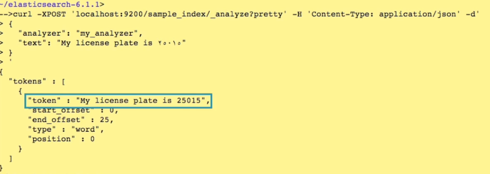 
        * 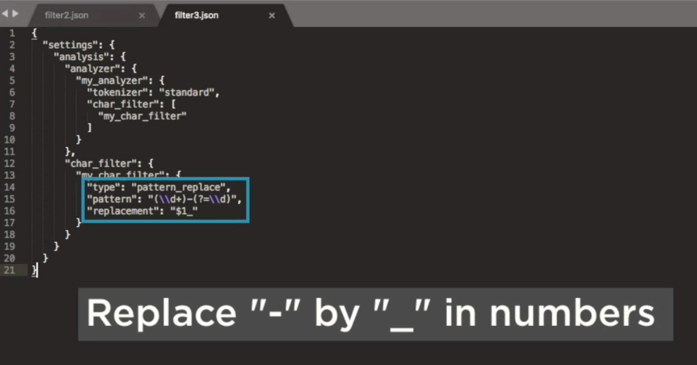  
        * 
    
    * [Analyzer per Language](https://www.elastic.co/guide/en/elasticsearch/reference/current/analysis-lang-analyzer.html)
        * ```json
            {
                "settings": {
                    "analysis": {
                    "filter": {
                        "english_stop": {
                        "type":       "stop",
                        "stopwords":  "_english_" 
                        },
                        "english_keywords": {
                        "type":       "keyword_marker",
                        "keywords":   ["example"] 
                        },
                        "english_stemmer": {
                        "type":       "stemmer",
                        "language":   "english"
                        },
                        "english_possessive_stemmer": {
                        "type":       "stemmer",
                        "language":   "possessive_english"
                        }
                    },
                    "analyzer": {
                        "rebuilt_english": {
                        "tokenizer":  "standard",
                        "filter": [
                            "english_possessive_stemmer",
                            "lowercase",
                            "english_stop",
                            "english_keywords",
                            "english_stemmer"
                        ]
                        }
                    }
                    }
                }
            }
            ```